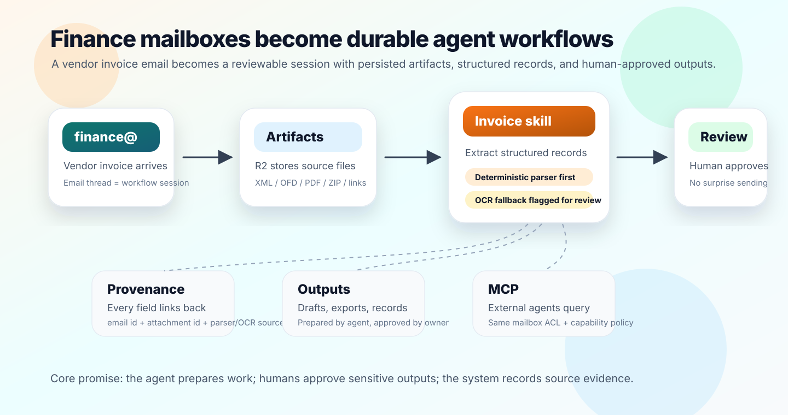

<div align="center">
  <h1>Agentic Inbox</h1>
  <p><em>Open-source agent-native mailboxes for durable workflows, running entirely on Cloudflare Workers</em></p>
</div>

Agentic Inbox turns shared role mailboxes into agent-native workspaces. It runs
entirely in your Cloudflare account: incoming emails arrive through
[Cloudflare Email Routing](https://developers.cloudflare.com/email-routing/),
each mailbox is isolated in a [Durable Object](https://developers.cloudflare.com/durable-objects/)
with SQLite state, and attachments are persisted in [R2](https://developers.cloudflare.com/r2/).

The fastest way to understand the product is `finance@`: an invoice email
arrives, the thread becomes a durable workflow session, attachments become
artifacts, agents extract structured invoice records, and humans review
sensitive outputs before anything external happens.



## Finance workflow in 90 seconds

A vendor sends an invoice to `finance@`. In a normal shared inbox, the work
fragments across downloads, spreadsheets, chat, and follow-up emails. In
Agentic Inbox, the mailbox keeps the workflow together:

1. **Email is the session** -- the invoice thread stays the durable record of
   the request, discussion, and follow-up.
2. **Attachments are artifacts** -- XML, OFD, PDF, ZIP, external-link downloads,
   and manual uploads are persisted and source-linked.
3. **Agents prepare work** -- invoice skills extract structured records, surface
   review flags, summarize context, and draft clarification replies.
4. **Humans stay in control** -- sending, deletion, export, and sensitive
   integration actions require explicit authority.
5. **MCP uses the same boundary** -- external agents can query and draft through
   scoped API keys without bypassing mailbox ACLs.

The point is not "AI writes email." The point is a role mailbox with memory,
artifacts, skills, and policy.

## What changes

| Normal shared inbox | Agentic Inbox |
| --- | --- |
| Email is a place where work arrives | Email is the durable workflow substrate |
| Attachments are downloaded and copied around | Attachments and derived files are persisted artifacts |
| Agents see broad context or brittle prompts | Agents use mailbox-scoped capabilities |
| Finance records drift away from source email | Extracted fields link back to source message and attachment ids |
| Automation risks surprise side effects | Agents draft by default; humans approve sensitive outputs |

## Try the finance demo

- Walk through the canonical flow: [Finance Workflow Demo](docs/finance-workflow-demo.md)
- Use the sample paths for a local or staging test:
  `docs/samples/finance-demo-email.md` and `docs/samples/finance-demo-invoice.xml`
- Read the product framing: [Product Narrative](docs/product-narrative.md)
- Inspect the architecture: [Foundation Architecture](docs/foundation-architecture.md)
- See the Cloudflare platform mapping: [Cloudflare Agentic Cloud Guide](docs/cloudflare-agentic-cloud-2026-guide.md)


Read the blog post to learn more about Cloudflare Email Service and how to use it with the Agents SDK, MCP, and from the Wrangler CLI: [Email for Agents](https://blog.cloudflare.com/email-for-agents/).

## How to setup

**Important**: Clicking the 'Deploy to Cloudflare' button is only one part of the setup. You must follow the **After deploying** steps as well. For a full step-by-step guide with screenshots, refer to this comment: 
https://github.com/cloudflare/agentic-inbox/issues/4#issuecomment-4269118513

### To set up

1. Deploy to Cloudflare. The deploy flow will automatically provision R2, Durable Objects, and Workers AI. You'll be prompted for **DOMAINS**, which is the domain (yourdomain.com) you want to receive emails for (email@yourdomain.com).

     [](https://deploy.workers.cloudflare.com/?url=https://github.com/cloudflare/agentic-inbox)

2. **Bootstrap an admin** -- Set the `ADMINS` Worker var (comma-separated emails) in `wrangler.jsonc`. The first user to register with one of those emails is automatically promoted to admin and can provision mailboxes for everyone else.
3. **Set up Email Routing** -- In the Cloudflare dashboard, go to your domain > Email Routing and create a catch-all rule that forwards to this Worker.
4. **Enable Email Service** -- The worker needs the `send_email` binding to send outbound emails. See [Email Service docs](https://developers.cloudflare.com/email-routing/email-workers/send-email-workers/).
5. **Register and create mailboxes** -- Visit your deployed app, register the admin account (the magic-link or password flow both work), then either create your own mailbox (when `EMAIL_ADDRESSES` is empty) or use the admin panel to provision mailboxes on behalf of teammates (when `EMAIL_ADDRESSES` is configured for shared/fixed addresses like `support@`, `finance@`).
6. _(Optional, legacy)_ **Cloudflare Access fallback** -- If your deployment was configured with [one-click Cloudflare Access](https://developers.cloudflare.com/changelog/post/2025-10-03-one-click-access-for-workers/) before native auth landed, set `POLICY_AUD` and `TEAM_DOMAIN` as Worker secrets. Access JWTs will be accepted alongside cookie sessions, so existing Access-only users keep working.

### Auth model

Identity is a D1-backed cookie session minted by `/api/v1/auth/login`, `/api/v1/auth/magic-link/consume`, or `/api/v1/auth/register` after email verification. Bearer API keys (issued from Settings → API Keys) authenticate programmatic callers including MCP clients. Cloudflare Access JWTs are accepted as a fallback when `POLICY_AUD`/`TEAM_DOMAIN` are set.

Authorization is layered:

* **Admin** (`users.role = 'admin'`): manages users, promotes other admins, provisions mailboxes for any user. Bootstrapped from the `ADMINS` env var on first registration.
* **Mailbox owner**: manages mailbox membership, invites, and integration-level config (e.g. webhook rule actions). One owner per mailbox.
* **Mailbox member**: read/write on mailbox content and ordinary workflows. Members can edit non-webhook rules but cannot grant themselves owner.
* **System**: internal worker-to-worker calls only (carries `x-internal-system: <INTERNAL_SECRET>`).

When `EMAIL_ADDRESSES` is configured (fixed-mailbox mode used for shared inboxes like `finance@`), self-serve mailbox creation is disabled — admins must provision and assign owners explicitly. Ownerless legacy mailboxes are not auto-claimed; admins assign owners via the admin panel.

### Troubleshooting Access

1. If you see `Invalid or expired Access token`, that usually means `POLICY_AUD` or `TEAM_DOMAIN` secrets are incorrect (only relevant when running in Access-fallback mode).
   * Resolution: [turn Access off and back on for the Worker to get the Access modal again](https://developers.cloudflare.com/changelog/post/2025-10-03-one-click-access-for-workers/), then reset your Worker secrets to the latest `POLICY_AUD` and `TEAM_DOMAIN` values shown there. Or remove both secrets to rely on native auth alone.

## Features

- **Full email client** — Send and receive emails via Cloudflare Email Routing with a rich text composer, reply/forward threading, folder organization, search, and attachments
- **Per-mailbox isolation** — Each mailbox runs in its own Durable Object with SQLite storage and R2 for attachments
- **Agent-native workspaces** — Role mailboxes such as `support@`, `finance@`, and `ops@` carry their own members, skills, prompts, rules, and persisted artifacts
- **Built-in AI agents** — Side panel with mailbox-scoped tools for reading, searching, drafting, extracting, and organizing work
- **Auto-draft on new email** — Agent automatically reads inbound emails and generates draft replies, always requiring explicit confirmation before sending
- **Configurable and persistent** — Custom system prompts per mailbox, persistent chat history, streaming markdown responses, and tool call visibility

## Stack

- **Frontend:** React 19, React Router v7, Tailwind CSS, Zustand, TipTap, `@cloudflare/kumo`
- **Backend:** Hono, Cloudflare Workers, Durable Objects (SQLite), R2, Email Routing
- **AI Agent:** Cloudflare Agents SDK (`AIChatAgent`), AI SDK v6, Workers AI (`@cf/moonshotai/kimi-k2.5`), `react-markdown` + `remark-gfm`
- **Auth:** Native cookie sessions (D1 + scrypt) with magic-link and password flows; per-user Bearer API keys for programmatic / MCP access; Cloudflare Access JWTs accepted as fallback when `POLICY_AUD`/`TEAM_DOMAIN` are set

## Getting Started

```bash
npm install
npm run dev
```

### Configuration

1. Set your domain in `wrangler.jsonc`
2. Create an R2 bucket named `agentic-inbox`: `wrangler r2 bucket create agentic-inbox`
3. **Required secret — `INTERNAL_SECRET`.** Used to sign the internal
   auth-context JWT that the Worker forwards to the agent and MCP Durable
   Objects (and to authenticate the inbound-email auto-draft path and
   mailbox invite tokens). Without it, `/mcp` and `/agents/*` return 500.
   Generate any high-entropy string and set it as a Worker secret:
   ```bash
   wrangler secret put INTERNAL_SECRET
   ```
   For local dev, copy `.dev.vars.example` to `.dev.vars` and replace the
   placeholder value.

### Deploy

```bash
npm run deploy
```

### CI/CD

Pull requests and pushes to `main` run the GitHub Actions `test` workflow. It
installs dependencies, runs `npm test`, runs the full `npm run verify` gate, and
then runs `npm run build`; all three gates must pass before the workflow is
green.

Production deployment is intentionally separate from CI. Use the manual
`deploy` workflow in GitHub Actions when you are ready to promote a commit. The
workflow targets the `production` environment, so configure environment
reviewers/protection in GitHub and provide these repository or environment
secrets:

- `CLOUDFLARE_API_TOKEN` — a token allowed to deploy this Worker.
- `CLOUDFLARE_ACCOUNT_ID` — the Cloudflare account that owns the Worker.

Worker runtime secrets such as `INTERNAL_SECRET`, `LLM_API_KEY`, and
`MCP_BEARER_KEK_CURRENT` are still managed through Wrangler secrets and are not
stored in the GitHub workflow file.

## Prerequisites

- Cloudflare account with a domain
- [Email Routing](https://developers.cloudflare.com/email-routing/) enabled for receiving
- [Email Service](https://developers.cloudflare.com/email-service/) enabled for sending
- [Workers AI](https://developers.cloudflare.com/workers-ai/) enabled (for the agent)
- _(Optional, legacy)_ [Cloudflare Access](https://developers.cloudflare.com/cloudflare-one/policies/access/) — only needed if you want Access JWTs to be accepted alongside native sessions. Set `POLICY_AUD` and `TEAM_DOMAIN` Worker secrets when used.

Authorization is per-mailbox. Each mailbox has an owner and an optional members list — only those callers (plus instance admins) can read/write its emails. The MCP server at `/mcp` honors the same ACL: an external AI tool authenticates with a per-user Bearer API key issued from Settings → API Keys and can only operate on mailboxes that user has access to.

## Architecture

```
┌──────────────┐     ┌──────────────────┐     ┌─────────────────┐
│   Browser    │────>│  Hono Worker     │────>│  MailboxDO      │
│  React SPA   │     │  (API + SSR)     │     │  (SQLite + R2)  │
│  Agent Panel │     │                  │     └─────────────────┘
└──────┬───────┘     │  /agents/* ──────┼────>┌─────────────────┐
       │             │                  │     │  EmailAgent DO  │
       │ WebSocket   │                  │     │  (AIChatAgent)  │
       └─────────────┤                  │     │  9 email tools  │
                     │                  │────>│  Workers AI     │
                     └──────────────────┘     └─────────────────┘
```

## License

Apache 2.0 -- see [LICENSE](LICENSE).
